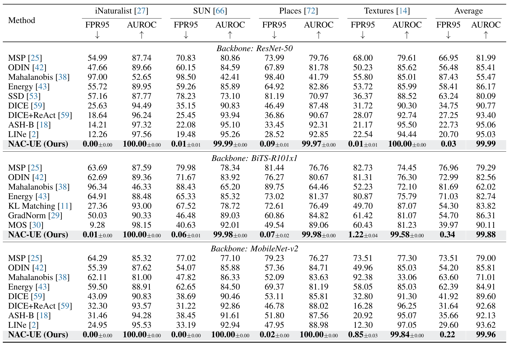

# Neuron Activation Coverage: Rethinking Out-of-distribution Detection and Generalization
This is the official PyTorch implementation of our NAC-UE: https://arxiv.org/abs/2306.02879.

## Usage
Our dataset and model preparation carefully follows the current OOD state-of-the-art methods, e.g., [MOS](https://arxiv.org/pdf/2105.01879.pdf), [ReAct](https://arxiv.org/abs/2111.12797), [GradNorm](https://arxiv.org/abs/2110.00218), [LINe](https://arxiv.org/abs/2303.13995).

### 1. ImageNet OOD benchmark

#### In-distribution dataset

Please download [ImageNet-1k](http://www.image-net.org/challenges/LSVRC/2012/index) and place the training data and validation data in
`./dataset/id_data/ILSVRC-2012/train` and  `./dataset/id_data/ILSVRC-2012/val`, respectively.

#### Out-of-distribution dataset
In the ImageNet benchmark, we use the following 4 OOD datasets for evaluation:
[iNaturalist](https://arxiv.org/pdf/1707.06642.pdf), 
[SUN](https://vision.princeton.edu/projects/2010/SUN/paper.pdf), 
[Places](http://places2.csail.mit.edu/PAMI_places.pdf), 
and [Textures](https://arxiv.org/pdf/1311.3618.pdf).

Following previous methods (e.g., [MOS](https://arxiv.org/pdf/2105.01879.pdf)), we use 10,000 images (with non-overlapping classes to ImageNet) for iNaturalist, SUN, and Places. We use the entire Textures dataset for evaluation. Please run the following script to download all of them (You can customize the ood dataroot as the following):
```
bash scripts/others/download.sh ./dataset/ood_data
```

For more details about these ImageNet OOD datasets, please check out the [MOS paper](https://arxiv.org/pdf/2105.01879.pdf).


### 2. Pre-trained Model Preparation

We employ pre-trained ResNet-50 and MobileNet-v2 provided by Pytorch. The download process will start automatically.

We utilize the ImageNet-1k pretrained BiTS-R101x1 following [GradNorm](https://arxiv.org/abs/2110.00218). Here we omit the process of pre-training a classification model on ImageNet-1k.
For ease of reproduction, we provide the pre-trained network below:
```bash
wget http://pages.cs.wisc.edu/~huangrui/finetuned_model/BiT-S-R101x1-flat-finetune.pth.tar
```
Please put the downloaded model in `./checkpoints/pretrained`.


### 3. OOD Detection Evaluation

To reproduce our NAC-UE results, please run the following (You should first update _out_dataroot_ and _in_datadir_ in the script):
```
./scripts/test_coverage.sh resnet50(/mobilenet/BiT-S-R101x1) 30
```

To reproduce baseline approaches, please run:
```
./scripts/test_baseline.sh resnet50(/mobilenet/BiT-S-R101x1) MSP(/ODIN/Energy/GradNorm) 64
```

## OOD Detection Results

NAC-UC achieves a record-breaking performance on the 4 OOD datasets.



## Citation

If you find our codebase useful, please cite our paper:
```
@article{liu2023NAC,
    title={Neuron Activation Coverage: Rethinking Out-of-distribution Detection and Generalization}, 
    author={Yibing Liu and Chris Xing Tian and Haoliang Li and Lei Ma and Shiqi Wang},
    journal={arXiv preprint arXiv:2306.02879},
    year={2023}
}
```

## Credits
Many baselines in this codebase are built based on two repositories: GradNorm ([On the Importance of Gradients for Detecting Distributional Shifts in the Wild
](https://github.com/deeplearning-wisc/gradnorm_ood)) and ReAct ([ReAct: Out-of-distribution Detection With Rectified Activations
](https://github.com/deeplearning-wisc/react)).
Many thanks for their generous sharing.

