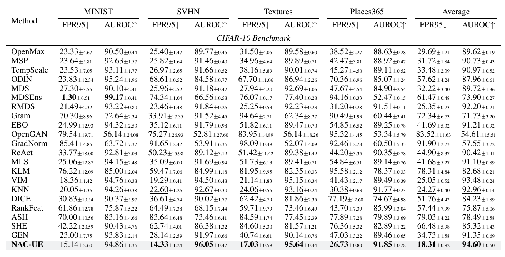

# [ICLR-2024] Neuron Activation Coverage: Rethinking Out-of-distribution Detection and Generalization

[//]: # (**[Warning] The method suffers from the overfitting issue. We will re-evaluate our NAC-UE on the OpenOOD v1.5 and update the code and arxiv ASAP.**)

This is the official PyTorch implementation of our NAC-UE: https://arxiv.org/abs/2306.02879. 
In this updated version, we re-evaluated NAC-UE on OpenOOD v1.5 without modifying the core method. It still outperforms 21 SoTA OOD detection methods across three benchmarks!

> Please see the source code for NAC-ME in the folder [domainbed](https://github.com/BierOne/ood_coverage/tree/master/domainbed), which is tailored for generalization tasks. 


## Usage
Our experimental settings carefully align with OpenOOD v1.5. We provide details for utilized benchmarks and models below. For more information, please refer to [https://github.com/Jingkang50/OpenOOD](https://github.com/Jingkang50/OpenOOD).

We provide the required packages in [environment.yml](https://github.com/BierOne/ood_coverage/tree/master/environment.yml), you can simply run the following command to create the environment:
```
conda env create -f environment.yml;
pip install libmr==0.1.9
```

 
### 1. OOD benchmark Preparation

To download all required InD and OOD datasets, you can use the [downloading script](https://github.com/BierOne/ood_coverage/tree/master/scripts/download) provided by OpenOOD. Specifically, please run:
```
bash scripts/download/download.sh 
```


### 2. Pre-trained Model Preparation

We employ ResNet-18 pretrained by OpenOOD v1.5. For ResNet-50 and Vit-b-16, we utilize the pretrained models provided by Pytorch. You can download checkpoints using the following links:

- CIFAR-10 [[Google Drive]](https://drive.google.com/file/d/1byGeYxM_PlLjT72wZsMQvP6popJeWBgt/view?usp=drive_link): ResNet-18 classifiers trained with cross-entropy loss from 3 training runs.
- CIFAR-100 [[Google Drive]](https://drive.google.com/file/d/1s-1oNrRtmA0pGefxXJOUVRYpaoAML0C-/view?usp=drive_link): ResNet-18 classifiers trained with cross-entropy loss from 3 training runs.
- ImageNet-200 [[Google Drive]](https://drive.google.com/file/d/1ddVmwc8zmzSjdLUO84EuV4Gz1c7vhIAs/view?usp=drive_link): ResNet-18 classifiers trained with cross-entropy loss from 3 training runs.
- ImageNet-1K [[Google Drive]](https://drive.google.com/file/d/15PdDMNRfnJ7f2oxW6lI-Ge4QJJH3Z0Fy/view?usp=drive_link): ResNet-50 classifiers including 1) the one from torchvision, 2) the ones that are trained by us with specific methods such as MOS, CIDER, and 3) the official checkpoints of data augmentation methods such as AugMix, PixMix.

These checkpoints can be also be downloaded with the [downloading script](https://github.com/BierOne/ood_coverage/tree/master/scripts/download).


### 3. OOD Detection Evaluation

#### 3.1 Split training data for sanity check
We utilize a subset of the InD training set for a sanity check to verify if the OOD detection method is overfitted. Please run the following command to split the training data (default: 1000 training images for sanity check):
```
bash scripts/split_train.sh 1000
```

#### 3.2 Evaluation on CIFAR-10 / CIFAR-100 / ImageNet-1k
We provide all scripts to reproduce our results in [here](https://github.com/BierOne/ood_coverage/tree/master/scripts/ood/nac).

- To reproduce our NAC-UE results on CIFAR-10 & CIFAR-100, please run the following:
    ```
    # CIFAR-10 (using 1000 training images to build NAC)
    bash scripts/ood/nac/cifar10_test_ood_nac.sh 128 1000 "avgpool layer3 layer2 layer1" aps
    ```
    ```
    # CIFAR-100 (using 1000 training images to build NAC)
    bash scripts/ood/nac/cifar100_test_ood_nac.sh 128 1000 "avgpool layer3 layer2 layer1" aps
    ```


- To reproduce our NAC-UE results on ImageNet-1k, please run the following:
    ```
    # ResNet-50 on ImageNet-1k (using 1000 training images to build NAC)
    bash scripts/ood/nac/imagenet_test_ood_nac.sh resnet50 64 1000 "avgpool layer3 layer2 layer1" aps cross
    ```
    ```
    # Vit-b-16 on ImageNet-1k (using 50000 training images to build NAC)
    bash scripts/ood/nac/imagenet_test_ood_nac.sh vit-b-16 64 50000 "layer_norm layer_11 layer_10 layer_9" aps cross
    ```

Note that _aps_ denotes the automatic paramter search, _cross_ indicates the models are pretrained using cross entropy loss.

Also, if you want to reproduce the baselines results (e.g., ReAct) using this repository, you can run the following command:

```
bash scripts/ood/react/cifar10_test_ood_react.sh;
bash scripts/ood/react/cifar100_test_ood_react.sh;
bash scripts/ood/react/imagenet_test_ood_react.sh
```


### 4. OOD Detection Evaluation with Faster Parameter Search

Here, we provide a faster way to implement NAC-UE for OOD detection.

- Firstly, you should run the following command to _cache all neuron states for data samples_:
    ```
    # CIFAR-10 or CIFAR-100 with ResNet-18  (1000 training images for building NAC)
    python scripts/classic_preprocess.py --id-data cifar10/cifar100 --arch resnet18 --layer-names  avgpool layer3 layer2 layer1 --batch-size 128 --valid-num 1000
    ```
    ```
    # ImageNet-1k with ResNet-50 (1000 training images for building NAC)
    python scripts/preprocess.py --id-data imagenet --arch resnet50 --layer-names avgpool layer3 layer2 layer1 --batch-size 64 --valid-num 1000 --tvs-pretrained
    ```
    ```
    # ImageNet-1k with Vit-b-16 (50000 training images for building NAC)
     python scripts/preprocess.py --id-data imagenet --arch vit-b-16 --layer-names layer_norm layer_11 layer_10 layer_9 --valid-num 50000 --tvs-pretrained --batch-size 64
    ```

- Then, you can search best hyperparameters using cached neuron states:
    ``` 
    # CIFAR-10 & CIFAR-100
  bash scripts/ood/nac/cached_cifar10_test_ood_nac.sh 128 1000 "avgpool layer3 layer2 layer1" aps
  bash scripts/ood/nac/cached_cifar100_test_ood_nac.sh 128 1000 "avgpool layer3 layer2 layer1" aps
    # ImageNet-1k
  bash scripts/ood/nac/cached_imagenet_test_ood_nac.sh resnet50 128 1000 "avgpool layer3 layer2 layer1" aps cross
  bash scripts/ood/nac/cached_imagenet_test_ood_nac.sh vit-b-16 64 50000 "layer_norm layer_11 layer_10 layer_9" aps cross
    ```


## OOD Detection Results

NAC-UC achieves SoTA performance on the 3 OOD benchmarks, CIFAR-10, CIFAR100, and ImageNet. For instance, you can check the results on CIFAR-10 below.





## Citation

If you find our codebase useful, please cite our paper:
```
@inproceedings{liu2024neuron,
 title={Neuron Activation Coverage: Rethinking Out-of-distribution Detection and Generalization},
 author={Yibing Liu and Chris XING TIAN and Haoliang Li and Lei Ma and Shiqi Wang},
 booktitle={ICLR},
 year={2024},
}
```

## Credits
This codebase is developed using [OpenOOD](https://github.com/Jingkang50/OpenOOD/tree/main) (version as of September 10, 2023). We extend our sincere gratitude for their generosity in providing this valuable resource.

